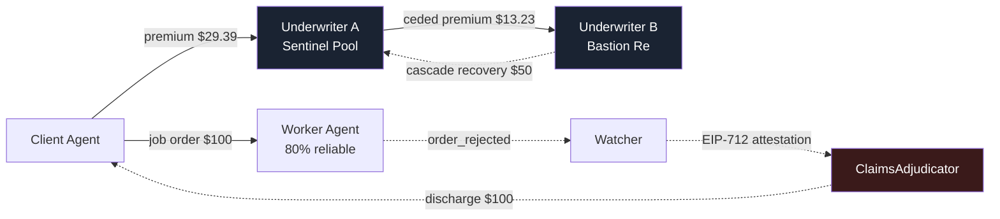

# HALON

> **Suppression layer for the agent economy.**
> On-chain insurance and reinsurance for the risk that an AI agent fails to deliver.
> Built on the [CROO Agent Protocol](https://docs.croo.network) (CAP), settled in USDC on Base.

**Why "HALON."** Halon is the fire-suppression gas in a server room. No human presses a button — the sensor trips, the gas discharges, the rack survives. That is the mechanism of this product: the moment CAP marks an order `rejected`, the pool pays. No approval, no vote, no claims desk. The vocabulary follows: *armed* (policy active), *discharge* (payout), *cascade* (recovery from the reinsurer), *retention* vs *cede* (risk held vs passed up).

---

## Project status

This is a hackathon build in progress. Being precise about what exists matters more than looking finished:

| Component | State | Notes |
| --- | --- | --- |
| **`dashboard/`** | ✅ **Built and building clean** | Next.js 16 + Tailwind 4. Renders the full pitch surface: cascade diagram, live quote engine, pool vaults, agent registry, policy book, claims feed, trust model. |
| **`dashboard/lib/risk-engine.ts`** | ✅ **Complete** | The actual pricing model. Pure functions, fully specified. This is the reference implementation `RiskEngine.sol` must mirror. |
| **`dashboard/lib/data.ts`** | ⚠️ **Deterministic fixture** | The dashboard reads a fixture, **not** live chain state. Premiums in it are computed by the real risk engine, not hand-typed. Swapping in viem/wagmi reads requires no component changes. |
| **`contracts/`** | 🚧 **Foundry scaffold only** | Currently the default `Counter.sol` template. `PolicyPool.sol`, `RiskEngine.sol`, and `ClaimsAdjudicator.sol` are **not written yet.** |
| **`agents/`** | 🚧 **Dependencies only** | `@croo-network/sdk`, `viem`, `tsx` installed and `.env.example` mapped. `src/` is empty — no agent runtime or watcher yet. |

**Nothing is deployed.** No contract addresses, no live agents on the CROO Agent Store. The numbers on the dashboard are a fixture designed to be replaced.

See [DESIGN.md](DESIGN.md) for the full design document (written in Indonesian), including SDK findings and open questions.

---

## The idea, in one paragraph

When Agent A hires Agent B through CAP, who eats the loss if B fails to deliver? Today: nobody. HALON adds a layer of **agent-to-agent insurance**. Before hiring a risky Worker Agent, a Client buys coverage from an **Underwriter Agent**. If the Worker fails, the Client is made whole automatically from the Underwriter's pool. And the Underwriter does not carry that risk alone — it automatically buys **reinsurance** from a second Underwriter with a deeper pool. The result is a layered A2A chain where agents hire agents who hire agents, all moving real USDC.

**The analogy.** You hire a driver (Worker). Before the trip you buy insurance (Underwriter A). The insurance company itself buys insurance from a reinsurer (Underwriter B). That is exactly how the real insurance industry works — we just moved it into the agent economy.

**"Auto-hedge"** is the part where Underwriter A buys reinsurance from B: it happens in code, seconds after A writes the policy, with no human in the loop.

> **The pitch, in one line:** *We are not building an agent that sells a service. We are building the market that makes every other agent worth trusting.*

---

## How the cascade works



**Underwriter A is simultaneously a provider and a requester.** That is where the A2A composability story lives — it is structural, not decorative.

### The money, with real numbers

Every figure below comes straight out of [`lib/risk-engine.ts`](dashboard/lib/risk-engine.ts). Worker reliability **80%**, coverage **$100**, tenor **24h**, pool utilization **35%**.

**Before the job:**

1. Client requests a quote from Underwriter A. RiskEngine returns a premium of **$29.39** (2,939 bps rate-on-line).
2. Client pays. The CAP order carries `fundAmount = $29.39` with `providerFundAddress` set to **PolicyPool A**, so the capital lands in the pool contract *atomically in the same pay transaction*. A policy NFT (ERC-721) is minted.
3. *(automatic)* A immediately opens a CAP order to B, ceding a **50% quota share** and forwarding **$13.23** of ceded premium into PolicyPool B. A keeps **$16.16** net.
4. Client hires the Worker — a $100 job over CAP.

**If the Worker succeeds:** A keeps $16.16, B keeps $13.23, nobody pays a claim.

**If the Worker fails** (`order_rejected` or `order_expired`):

1. The Watcher sees the CAP WebSocket event and submits an EIP-712 attestation to `ClaimsAdjudicator`.
2. **PolicyPool A discharges $100** to the Client. Automatically.
3. **Cascade:** PolicyPool B reimburses **$50** to PolicyPool A.
4. The real loss splits: A carries $50 of retention, B carries $50 of ceded exposure.

Expected margin per policy at these inputs: **A: +$4.66, B: +$1.73.** Both layers are margin-positive, or the market has no reason to exist.

> **Note:** DESIGN.md §6 illustrates this flow with a $5 premium. That number is wrong and is superseded here — expected loss on that policy is $20, so a $5 premium bleeds the pool dry. The risk engine prices it at $29.39 and shows the full decomposition on screen.

---

## The pricing model

CAP gives an order two terminal failure states, and they are not the same risk, so HALON does not price them as one.

| Hazard | Meaning | Formula |
| --- | --- | --- |
| `rejectionHazard` | Worker delivered, client refused it. Independent of the policy window. | `1 − reliability` |
| `expiryHazard` | Worker blew `slaDeadline`. A longer window means more chances to blow one. | `rejectionHazard × β × (tenorHours / 24)` |
| `totalHazard` | | `min(rejectionHazard + expiryHazard, 1)` |

```
expectedLoss = coverage × totalHazard        ← the actuarially fair premium
riskLoad     = λ × rejectionHazard           λ = 0.75, convex in risk
utilFactor   = 1 + κ × utilization²          κ = 0.60, scarce capital is dear
expenseFee   = max($0.25, 1% × coverage)     underwriter opex

premium = expectedLoss × (1 + riskLoad) × utilFactor + expenseFee
```

### The solvency invariant

Because `riskLoad ≥ 0`, `utilFactor ≥ 1`, and `expenseFee > 0`:

```
premium ≥ expectedLoss + expenseFee > expectedLoss     for every input
```

Solvency is **structural**, not a number tuned into place. An earlier draft multiplied expected loss by `√(tenor/24)`, which quietly priced 12-hour policies *below* their own expected loss. Tenor now moves the hazard, never the loading — a shorter window cannot make a coin flip cheaper than the coin flip.

There is no `sqrt` left in the model, so `RiskEngine.sol` reduces to a handful of fixed-point `mulDiv`s.

### Underwriting limits

| Guard | Value | Behaviour |
| --- | --- | --- |
| `RELIABILITY_FLOOR` | 60% | Below this, decline at any price. At 60% the technical premium is already ~63% of coverage — past there you are not buying insurance, you are prepaying the loss. |
| `MAX_RATE` | 75% rate-on-line | A quote needing more than this is **declined, not capped.** |
| `CEDED_SHARE` | 50% | Quota-share treaty: the reinsurer picks up half of every loss. |
| `CEDING_COMMISSION` | 10% | A keeps a slice of the ceded premium for originating and servicing the policy. Real treaties run 15–35%; kept thin so both layers stay margin-positive. |

### Reliability is derived, not read

The CAP SDK exposes **no reputation getter** — there is no `getMeritScore()`. So HALON computes its own **Reliability Index** from on-chain order history:

```ts
reliability = completed / (completed + rejected + expired)
```

That constraint turned out to be a feature: the index is a product in its own right, publishable and sellable to any other agent.

### Worked examples

| Reliability | Expected loss | Premium | Rate | Solvency multiple | Insurable? |
| --- | --- | --- | --- | --- | --- |
| 95% | $5.75 | **$7.40** | 740 bps | 1.29× | ✅ Prime |
| 80% | $23.00 | **$29.39** | 2,939 bps | 1.28× | ✅ Standard |
| 55% | $51.75 | *$75.30* | 7,530 bps | 1.46× | ❌ Below the 60% floor |

*(coverage $100, tenor 24h, utilization 35%)*

---

## Architecture

```
┌──────────────────────────────────────────────────────────┐
│  DASHBOARD (Next.js)                          ✅ built    │
│  pool size · premium curve · policies · claims feed      │
├──────────────────────────────────────────────────────────┤
│  AGENT RUNTIME (Node + @croo-network/sdk)     🚧 empty    │
│  4 agents, one SDK-Key + wallet each                     │
│  Watcher: connectWebSocket() → listen for order_rejected │
├──────────────────────────────────────────────────────────┤
│  HALON CONTRACTS (Solidity, Base)             🚧 scaffold │
│  PolicyPool · RiskEngine · ClaimsAdjudicator             │
├──────────────────────────────────────────────────────────┤
│  CAP — order lifecycle, escrow, settlement    ← consumed │
├──────────────────────────────────────────────────────────┤
│  Base L2 + USDC                                          │
└──────────────────────────────────────────────────────────┘
```

### The four agents

| Agent | Role | Listed service |
| --- | --- | --- |
| **Worker** | The "risky" agent being insured | `Data Analysis` — fail rate riggable for the demo |
| **Client** | Requester; buys coverage, then hires the Worker | — (it is the buyer) |
| **Underwriter A** | Sells coverage; **also buys reinsurance from B** | `Buy Coverage` (`require_fund_transfer=true`) |
| **Underwriter B** | Reinsurer, deeper pool | `Reinsurance` (`require_fund_transfer=true`) |

### The three contracts

| Contract | Responsibility |
| --- | --- |
| **`PolicyPool.sol`** | USDC vault per underwriter. Deposit capital, lock capital per policy, mint the policy (ERC-721), pay claims. Receives `fundAmount` directly from the CAP pay-tx. |
| **`RiskEngine.sol`** | `premium = f(reliability, coverage, tenor, utilization)`. Pure `view` — trivially unit-testable, trivially demoable. |
| **`ClaimsAdjudicator.sol`** | Verifies the Watcher's EIP-712 attestation ("order X is `rejected`, txHash Y"), checks the policy is armed, triggers the discharge from PolicyPool, then **cascades recovery** into the reinsurer's pool. |

Reinsurance is **not a new contract** — it is an ordinary CAP order from A to B. The only thing to persist is the link `policyId → reinsurancePolicyId`, so cascade recovery knows where to collect.

### Why `require_fund_transfer` is the whole trick

CAP separates two money flows inside a single order:

- **`price` / `feeAmount`** — escrowed by CAP, released to the provider on completion → we use it as the underwriter's **fee/spread**.
- **`fundAmount` + `fundToken` → `providerFundAddress`** — a direct USDC transfer to a provider-chosen address, inside the same pay-tx batch → we set `providerFundAddress` to the **`PolicyPool` contract**.

So premium capital lands in the pool **atomically in the pay transaction**. There is no "now manually transfer the funds" step that can fail halfway. And the exact same shape is reused when A buys reinsurance from B — which is why the chain is naturally recursive.

```ts
await client.negotiateOrder({ serviceId, fundAmount, fundToken })
// provider side:
await client.acceptNegotiationWithFundAddress(negotiationId, providerFundAddress)
```

### Failure detection needs no oracle

CAP's order lifecycle already has terminal failure states, plus WebSocket events and an on-chain `rejectTxHash` / `slaDeadline`. **That is our definition of "the Worker failed."** No Chainlink, no voting.

```
creating → created → paying → paid → delivering → completed
                                   ↘ rejected   ← claim!
                                   ↘ expired    ← claim!
```

---

## Repository layout

```
halon/
├── DESIGN.md              full design doc (Indonesian) — SDK findings, open questions
├── README.md              this file
├── contracts/             Foundry — PolicyPool, RiskEngine, ClaimsAdjudicator
│   ├── src/               🚧 Counter.sol placeholder
│   ├── test/
│   ├── script/
│   └── remappings.txt
├── agents/                Node + CAP SDK — 4 agents + watcher
│   ├── src/               🚧 empty
│   └── .env.example
└── dashboard/             Next.js 16 + Tailwind 4
    ├── app/
    ├── components/        hero, cascade-diagram, quote-engine, pool-vaults, …
    └── lib/
        ├── risk-engine.ts ✅ the pricing model
        ├── data.ts        ⚠️ deterministic fixture
        └── types.ts       domain types mirroring CAP + our contracts
```

---

## Getting started

### Dashboard

The only part you can run end-to-end today.

```bash
cd dashboard
npm install
npm run dev          # http://localhost:3000
npm run build        # production build — currently green
```

No environment variables needed. It renders entirely from the fixture.

> ⚠️ `dashboard/` targets **Next.js 16**, which has breaking changes relative to Next 14/15. Check `node_modules/next/dist/docs/` before writing new code there — see [dashboard/AGENTS.md](dashboard/AGENTS.md).

### Contracts

`contracts/lib/` is gitignored and the dependencies were installed with `--no-git`, so **they are not submodules**. A fresh clone must reinstall them:

```bash
cd contracts
forge install foundry-rs/forge-std --no-git
forge install OpenZeppelin/openzeppelin-contracts@v5.1.0 --no-git
forge build
forge test
```

Requires **Foundry 1.7.1+**. The remappings in [`remappings.txt`](contracts/remappings.txt) assume exactly those two paths.

### Agents

```bash
cd agents
npm install
cp .env.example .env     # fill in one SDK-Key per agent
npx tsx src/<script>.ts   # 🚧 nothing to run yet
```

Requires **Node 20+**. `.env.example` maps every key you will need: CAP endpoints, four SDK-Keys, three service IDs, the deployed contract addresses, and the attestor private key.

---

## CAP SDK surface

The methods HALON actually calls — all real, none stubbed:

`negotiateOrder` · `acceptNegotiationWithFundAddress` · `payOrder` · `deliverOrder` · `rejectOrder` · `getOrder` · `listOrders` · `getDelivery` · `connectWebSocket`

---

## Tech stack

| Layer | Choice | Status |
| --- | --- | --- |
| Chain | Base — SDK default RPC `https://mainnet.base.org` | ✅ confirmed from `Config.rpcURL` |
| Token | USDC `0x8335…2913` (Base mainnet) | ✅ |
| Contracts | Solidity `0.8.35` + Foundry `1.7.1` | ✅ toolchain green |
| Contract libs | OpenZeppelin `v5.1.0` (ERC-20/721, AccessControl, ReentrancyGuard) | ✅ remappings verified |
| CAP integration | `@croo-network/sdk@0.2.1` | ✅ installed |
| Agent runtime | Node 20 + TypeScript + `tsx` | ✅ installed |
| Chain reads | `viem` | ✅ installed |
| Dashboard | Next.js 16 + Tailwind 4 | ✅ built |
| Deploy | Contracts → Foundry script; Dashboard → Vercel | ⬜ |

---

## Trust model — stated plainly

**The Watcher is a trusted oracle in this MVP.** It is the party that signs "order X failed." If it lies or goes down, the system misbehaves. There is no dispute period and no fraud proof.

The roadmap is to read order status directly from CAP's escrow contract on-chain, which removes the Watcher from the trust path entirely.

This is called out deliberately, in the README and in the demo. Judges respect a team that knows the boundary of its own system more than a team that pretends to be trustless.

### Anti-sybil note ⚠️

CROO's rules require a minimum of **3 unique counterparty agents** and **5 unique buyer wallets**, and concentrated self-trading patterns get flagged. A four-agent design where money circulates among our own agents naturally trips that shape.

**Mitigation:** get other hackathon teams to buy coverage on their agents — comp the premium if needed. That doubles as the strongest possible evidence that the product is genuinely composable.

---

## Open questions

Not yet verified from the SDK alone. Do not assume these are settled:

- [ ] The correct `baseURL` / `wsURL`. Values in `.env.example` are still guesses.
- [ ] **Is there a testnet (Base Sepolia)?** The SDK defaults to Base *mainnet*. If there is no testnet, all development spends real money — budget accordingly.
- [ ] How to register a service and set `require_fund_transfer=true`. Absent from the SDK; likely a dashboard or REST API operation.
- [ ] The "0% gas", ERC-8004, and ERC-4337 claims. These come from marketing material and are not confirmed anywhere in the SDK code.
- [ ] **Who is allowed to call `rejectOrder`, and is there a dispute flow?** If a Worker can contest being blamed, `ClaimsAdjudicator` needs a challenge window.

---

## Roadmap

1. Resolve the open questions above — wrong assumptions here are the most expensive way to lose time.
2. Write `RiskEngine.sol` first. Pure `view`, fastest to finish, immediately demoable, and [`risk-engine.ts`](dashboard/lib/risk-engine.ts) is already its complete specification.
3. Then `PolicyPool.sol` and its tests.
4. Then `ClaimsAdjudicator.sol` + EIP-712 attestation.
5. Wire up the four agents and the Watcher — easiest step once the contracts are clean.
6. Replace `dashboard/lib/data.ts` with viem/wagmi reads. No component should need to change.
7. Add a `LICENSE` file and deploy.

---

## License

MIT, intended — the `LICENSE` file has not been committed yet.

---

<div align="center">

**HALON** — *Nobody pulls the trigger. It just discharges.*

Built for the CROO Hackathon · Track: DeFi / On-chain Ops

</div>
