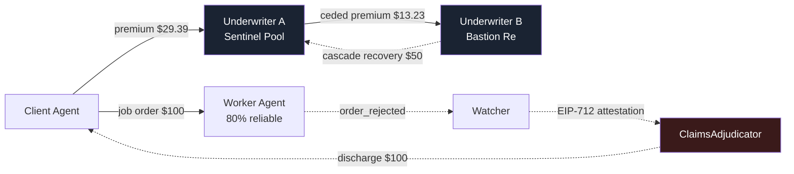

# HALON

> **Suppression layer for the agent economy.**
> On-chain insurance and reinsurance for the risk that an AI agent fails to deliver.
> Built on the [CROO Agent Protocol](https://docs.croo.network) (CAP), settled in USDC on Base.

**Why "HALON."** Halon is the fire-suppression gas in a server room. No human presses a button — the sensor trips, the gas discharges, the rack survives. That is the mechanism of this product: the moment CAP marks an order `rejected`, the pool pays. No approval, no vote, no claims desk. The vocabulary follows: *armed* (policy active), *discharge* (payout), *cascade* (recovery from the reinsurer), *retention* vs *cede* (risk held vs passed up).

---

## Project status

This is a hackathon build in progress. Being precise about what exists matters more than looking finished:

| Component | State | Notes |
| --- | --- | --- |
| **`dashboard/`** | ✅ **Built and building clean** | Next.js 16 + Tailwind 4. Renders the full pitch surface: cascade diagram, live quote engine, pool vaults, agent registry, policy book, claims feed, trust model. |
| **`dashboard/lib/risk-engine.ts`** | ✅ **Complete** | The actual pricing model. Pure functions, fully specified. This is the reference implementation `RiskEngine.sol` mirrors — and `forge test` holds the two together. |
| **`dashboard/lib/data.ts`** | ⚠️ **Deterministic fixture** | The dashboard reads a fixture, **not** live chain state. Premiums in it are computed by the real risk engine, not hand-typed. Swapping in viem/wagmi reads requires no component changes. |
| **`contracts/src/RiskEngine.sol`** | ✅ **Written · 18 tests** | Fixed-point port of `risk-engine.ts`. `forge test` pins it to the worked examples below, and fuzzes the solvency invariant across the whole input space. |
| **`contracts/src/PolicyPool.sol`** | ✅ **Written · 21 tests** | The vault, the ERC-721 policy, the cede, the discharge, the cascade. One contract serves both layers: a reinsurance treaty is just a policy whose beneficiary is another pool. |
| **`contracts/src/ClaimsAdjudicator.sol`** | ✅ **Written · 19 tests** | EIP-712 attestation, k-of-n attestors, replay protection, best-effort cascade — and the gate that refuses to auto-pay a claim whose beneficiary pulled the trigger. |
| **`agents/src/`** | ✅ **Written, typechecks** | Four CAP agents and the Watcher. `npm run verify-wiring` checks the hand-written ABIs and the EIP-712 struct against a live deployment. |

**Nothing is deployed and nothing has run against real CAP.** No contract addresses, no live agents on the CROO Agent Store, no SDK-Keys. `forge test` is green (58 tests), `tsc --noEmit` is clean, and the whole stack has been deployed to a local `anvil` and verified end to end — but the CAP integration itself is unexercised, because the two blockers in **Open questions** below are not resolved. The numbers on the dashboard are still a fixture.

See [DESIGN.md](DESIGN.md) for the full design document (written in Indonesian), including SDK findings and open questions.

---

## The idea, in one paragraph

When Agent A hires Agent B through CAP, who eats the loss if B fails to deliver? Today: nobody. HALON adds a layer of **agent-to-agent insurance**. Before hiring a risky Worker Agent, a Client buys coverage from an **Underwriter Agent**. If the Worker fails, the Client is made whole automatically from the Underwriter's pool. And the Underwriter does not carry that risk alone — it automatically buys **reinsurance** from a second Underwriter with a deeper pool. The result is a layered A2A chain where agents hire agents who hire agents, all moving real USDC.

**The analogy.** You hire a driver (Worker). Before the trip you buy insurance (Underwriter A). The insurance company itself buys insurance from a reinsurer (Underwriter B). That is exactly how the real insurance industry works — we just moved it into the agent economy.

**"Auto-hedge"** is the part where Underwriter A buys reinsurance from B: it happens in code, seconds after A writes the policy, with no human in the loop.

> **The pitch, in one line:** *We are not building an agent that sells a service. We are building the market that makes every other agent worth trusting.*

---

## How the cascade works



**Underwriter A is simultaneously a provider and a requester.** That is where the A2A composability story lives — it is structural, not decorative.

### The money, with real numbers

Every figure below comes straight out of [`lib/risk-engine.ts`](dashboard/lib/risk-engine.ts). Worker reliability **80%**, coverage **$100**, tenor **24h**, pool utilization **35%**.

**Before the job:**

1. Client negotiates the hire with the Worker. CAP creates the job order — **unpaid, but its id now exists**, and that id is what the policy will name. `ClaimsAdjudicator` matches a claim against `insuredOrderId`, so cover bought against the wrong order can never pay.
2. Client requests a quote from Underwriter A. RiskEngine returns a premium of **$29.39** (2,939 bps rate-on-line).
3. Client pays. The CAP order carries `fundAmount = $29.39` with `providerFundAddress` set to **PolicyPool A**, so the capital lands in the pool contract *atomically in the same pay transaction*. A policy NFT (ERC-721) is minted.
4. *(automatic)* A immediately opens a CAP order to B, ceding a **50% quota share** and forwarding **$13.23** of ceded premium into PolicyPool B. A keeps **$16.17** net.
5. Only now does the Client pay the job order. Cover is armed before a cent is at risk.

**If the Worker succeeds:** A keeps $16.17, B keeps $13.23, nobody pays a claim.

**If the Worker fails** (`order_rejected` or `order_expired`):

1. The Watcher sees the CAP WebSocket event, calls `getDelivery(orderId)` to confirm the Worker never submitted anything, and submits an EIP-712 attestation to `ClaimsAdjudicator`.
2. **PolicyPool A discharges $100** to the Client. Automatically.
3. **Cascade:** PolicyPool B reimburses **$50** to PolicyPool A.
4. The real loss splits: A carries $50 of retention, B carries $50 of ceded exposure.

Expected margin per policy at these inputs: **A: +$4.67, B: +$1.73.** Both layers are margin-positive — A structurally, B by way of the loading guard below.

> **A cent of pedantry.** $29.39 and $13.23 are the figures *displayed*. `RiskEngine.sol` holds micro-USDC and never rounds, so A's net is $29.394075 − $13.227333 = **$16.166742**. Subtracting one rounded number from another is not the same as rounding a subtraction, and the chain is the side that actually moves the USDC — so these tables follow the chain. An earlier draft of this README said $16.16 and $4.66.

> **Note:** DESIGN.md §6 illustrates this flow with a $5 premium. That number is wrong and is superseded here — expected loss on that policy is $20, so a $5 premium bleeds the pool dry. The risk engine prices it at $29.39 and shows the full decomposition on screen.

---

## The pricing model

CAP gives an order two terminal failure states, and they are not the same risk, so HALON does not price them as one.

| Hazard | Meaning | Formula |
| --- | --- | --- |
| `rejectionHazard` | Worker delivered, client refused it. Independent of the policy window. | `1 − reliability` |
| `expiryHazard` | Worker blew `slaDeadline`. A longer window means more chances to blow one. | `rejectionHazard × β × (tenorHours / 24)` |
| `totalHazard` | | `min(rejectionHazard + expiryHazard, 1)` |

```
expectedLoss = coverage × totalHazard        ← the actuarially fair premium
riskLoad     = λ × rejectionHazard           λ = 0.75, convex in risk
utilFactor   = 1 + κ × utilization²          κ = 0.60, scarce capital is dear
expenseFee   = max($0.25, 1% × coverage)     underwriter opex

premium = expectedLoss × (1 + riskLoad) × utilFactor + expenseFee
```

### The solvency invariant

Because `riskLoad ≥ 0`, `utilFactor ≥ 1`, and `expenseFee > 0`:

```
premium ≥ expectedLoss + expenseFee > expectedLoss     for every input
```

Solvency is **structural**, not a number tuned into place. An earlier draft multiplied expected loss by `√(tenor/24)`, which quietly priced 12-hour policies *below* their own expected loss. Tenor now moves the hazard, never the loading — a shorter window cannot make a coin flip cheaper than the coin flip.

There is no `sqrt` left in the model, so `RiskEngine.sol` reduces to a handful of fixed-point `mulDiv`s.

### Solvency for us is not solvency for the reinsurer

The invariant above keeps **Pool A** whole. It says nothing about **Pool B**, which absorbs `cededShare` of every loss but is paid only `cededShare × (1 − cedingCommission)` of the premium. Solve for when B clears zero and `cededShare` cancels off both sides, leaving a condition on the loading alone:

```
premium × (1 − cedingCommission) ≥ expectedLoss
```

`riskLoad` is a function of `rejectionHazard` alone, but a long tenor inflates `expectedLoss` without touching it. So past roughly 1,400 hours the loading thins below the 10% commission and B is underwater — on a policy that cleared the reliability floor *and* the rate cap. A 99%-reliable agent, $1M of cover, an 83-day window: 11.45% rate-on-line, and Bastion Re loses $337 in expectation.

`RiskEngine.t.sol` found that by fuzzing, not by inspection. Those quotes are now **declined**, in the contract and in the dashboard.

Read the same inequality from Pool B's side and it says the ceded premium never falls below the reinsurer's expected loss on the layer it takes. That is what `PolicyPool.bindTreaty` checks — **not** B's retail rate. A treaty carries no second expense fee and forwards a premium that was already loaded once, so it arrives *below* what B charges retail for the same layer: on the reference policy, $12.35 ceded against a $13.72 shelf price, over an expected loss of $11.50. A policy the cedent was allowed to write is always a treaty the reinsurer is allowed to accept.

### Underwriting limits

| Guard | Value | Behaviour |
| --- | --- | --- |
| `RELIABILITY_FLOOR` | 60% | Below this, decline at any price. At 60% the technical premium is already ~63% of coverage — past there you are not buying insurance, you are prepaying the loss. |
| `MAX_RATE` | 75% rate-on-line | A quote needing more than this is **declined, not capped.** |
| `CEDED_SHARE` | 50% | Quota-share treaty: the reinsurer picks up half of every loss. |
| `CEDING_COMMISSION` | 10% | A keeps a slice of the ceded premium for originating and servicing the policy. Real treaties run 15–35%; kept thin so both layers stay margin-positive. |
| **Loading guard** | `premium × (1 − commission) ≥ expectedLoss` | A quote the reinsurer cannot take at a profit is **declined**, not written. See above. |

### Reliability is derived, not read

The CAP SDK exposes **no reputation getter** — there is no `getMeritScore()`. So HALON computes its own **Reliability Index** from on-chain order history:

```ts
reliability = completed / (completed + rejected + expired)
```

That constraint turned out to be a feature: the index is a product in its own right, publishable and sellable to any other agent.

It also has a consequence worth knowing before demo day. `reliabilityOf(0, 0, 0)` is **zero** — an agent with no completed orders is not prime, it is unproven — and zero is far below the 60% floor. So a freshly listed Worker cannot be insured at all, and `npm run demo` will stop at the quote with *"declined by the RiskEngine."* That is correct behaviour, not a bug. `npm run seed` runs a few jobs to completion first so the index has something to read.

### Worked examples

| Reliability | Expected loss | Premium | Rate | Solvency multiple | Insurable? |
| --- | --- | --- | --- | --- | --- |
| 95% | $5.75 | **$7.40** | 740 bps | 1.29× | ✅ Prime |
| 80% | $23.00 | **$29.39** | 2,939 bps | 1.28× | ✅ Standard |
| 55% | $51.75 | *$75.30* | 7,530 bps | 1.46× | ❌ Below the 60% floor |

*(coverage $100, tenor 24h, utilization 35%)*

---

## Architecture

```
┌──────────────────────────────────────────────────────────┐
│  DASHBOARD (Next.js)                          ✅ built    │
│  pool size · premium curve · policies · claims feed      │
├──────────────────────────────────────────────────────────┤
│  AGENT RUNTIME (Node + @croo-network/sdk)     ✅ written  │
│  4 agents, one SDK-Key + wallet each                     │
│  Watcher: connectWebSocket() → listen for order_rejected │
├──────────────────────────────────────────────────────────┤
│  HALON CONTRACTS (Solidity, Base)             ✅ written  │
│  PolicyPool · RiskEngine · ClaimsAdjudicator             │
├──────────────────────────────────────────────────────────┤
│  CAP — order lifecycle, escrow, settlement    ← consumed │
├──────────────────────────────────────────────────────────┤
│  Base L2 + USDC                                          │
└──────────────────────────────────────────────────────────┘
```

### The four agents

| Agent | Role | Listed service |
| --- | --- | --- |
| **Worker** | The "risky" agent being insured | `Data Analysis` — fail rate riggable for the demo |
| **Client** | Requester; buys coverage, then hires the Worker | — (it is the buyer) |
| **Underwriter A** | Sells coverage; **also buys reinsurance from B** | `Buy Coverage` (`require_fund_transfer=true`) |
| **Underwriter B** | Reinsurer, deeper pool | `Reinsurance` (`require_fund_transfer=true`) |

### The three contracts

| Contract | Responsibility |
| --- | --- |
| **`PolicyPool.sol`** | USDC vault per underwriter. Deposit capital, lock capital per policy, mint the policy (ERC-721), pay claims, collect the cascade. Receives `fundAmount` directly from the CAP pay-tx — and reconciles it by balance delta, because a plain ERC-20 transfer gives it nothing to hook. |
| **`RiskEngine.sol`** | `premium = f(reliability, coverage, tenor, utilization)`. Pure `view` — trivially unit-testable, trivially demoable. |
| **`ClaimsAdjudicator.sol`** | Verifies the Watcher's EIP-712 attestation ("order X is `rejected`, txHash Y"), checks the policy is armed, triggers the discharge from PolicyPool, then **cascades recovery** into the reinsurer's pool. |

Reinsurance is **not a new contract** — it is an ordinary CAP order from A to B. The only thing to persist is the link `policyId → reinsurancePolicyId`, so cascade recovery knows where to collect.

### Why `require_fund_transfer` is the whole trick

CAP separates two money flows inside a single order:

- **`price` / `feeAmount`** — escrowed by CAP, released to the provider on completion → we use it as the underwriter's **fee/spread**.
- **`fundAmount` + `fundToken` → `providerFundAddress`** — a direct USDC transfer to a provider-chosen address, inside the same pay-tx batch → we set `providerFundAddress` to the **`PolicyPool` contract**.

So premium capital lands in the pool **atomically in the pay transaction**. There is no "now manually transfer the funds" step that can fail halfway. And the exact same shape is reused when A buys reinsurance from B — which is why the chain is naturally recursive.

```ts
await client.negotiateOrder({ serviceId, fundAmount, fundToken })
// provider side:
await client.acceptNegotiationWithFundAddress(negotiationId, providerFundAddress)
```

### …but the pool has no hook

`fundAmount` arrives as a plain ERC-20 transfer. There is no callback — nothing `PolicyPool` gets to execute at the moment the money lands. So the pool reconciles by **balance delta**: `sync()` sweeps any unaccounted USDC into `pendingInflow`, and `bindDirect` refuses to write a policy whose premium has not actually shown up. The atomicity is real, but it is CAP's, not ours. We can only verify afterwards — and we do.

The same scepticism runs through the cede. At bind the pool locks the **full coverage**, because it has no reinsurance yet. `attachReinsurance` does not take the underwriter's word for the treaty: it reads it out of Pool B's storage and checks that Pool A holds the treaty NFT, that it is armed, that it does not exceed the coverage it backs, and that it does not lapse before the policy does — cover that expires first is not cover. Only then is the ceded capital released.

So Pool A locks its retention, Pool B locks the ceded share, and between them the coverage is locked exactly once. Reinsurance buys capacity, which is the entire reason to buy it.

One thing `discharge` deliberately does **not** do is wait for the cascade. A cedent owes its client whether or not its reinsurer performs; the recovery is a receivable, not a precondition. A pool that pays ahead of its recovery goes briefly under-reserved — it stops writing new cover, it does not stop paying.

### Failure detection needs no oracle

CAP's order lifecycle already has terminal failure states, plus WebSocket events and an on-chain `rejectTxHash` / `slaDeadline`. **That is our definition of "the Worker failed."** No Chainlink, no voting.

```
creating → created → paying → paid → delivering → completed
                                   ↘ rejected   ← claim!
                                   ↘ expired    ← claim!
```

---

## Repository layout

```
halon/
├── DESIGN.md              full design doc (Indonesian) — SDK findings, open questions
├── README.md              this file
├── contracts/             Foundry — RiskEngine, PolicyPool, ClaimsAdjudicator
│   ├── src/               ✅ all three
│   ├── test/              ✅ 58 tests, 4 of them fuzz properties
│   ├── script/Deploy.s.sol
│   └── remappings.txt
├── agents/                Node + CAP SDK — 4 agents + watcher
│   ├── src/
│   │   ├── lib/           env, ABIs, viem clients, the Reliability Index
│   │   ├── worker.ts      Aurora Analytics — the risky agent
│   │   ├── client.ts      Meridian Capital — the buyer, and the demo driver
│   │   ├── underwriter-a.ts  Sentinel — sells cover, then hedges itself
│   │   ├── underwriter-b.ts  Bastion Re — the layer under the layer
│   │   ├── watcher.ts     signs the attestation, refuses the bad ones
│   │   └── seed.ts        an agent with no history cannot be insured
│   ├── scripts/
│   │   ├── verify-wiring.ts    ABIs + EIP-712 vs a live deployment
│   │   └── deposit-capital.ts  approve + depositCapital, both pools
│   └── .env.example
└── dashboard/             Next.js 16 + Tailwind 4
    ├── app/
    ├── components/        hero, cascade-diagram, quote-engine, pool-vaults, …
    └── lib/
        ├── risk-engine.ts ✅ the pricing model
        ├── data.ts        ⚠️ deterministic fixture
        └── types.ts       domain types mirroring CAP + our contracts
```

---

## Getting started

### Dashboard

The only part you can run end-to-end today.

```bash
cd dashboard
npm install
npm run dev          # http://localhost:3000
npm run build        # production build — currently green
```

No environment variables needed. It renders entirely from the fixture.

> ⚠️ `dashboard/` targets **Next.js 16**, which has breaking changes relative to Next 14/15. Check `node_modules/next/dist/docs/` before writing new code there — see [dashboard/AGENTS.md](dashboard/AGENTS.md).

### Contracts

`contracts/lib/` is gitignored and the dependencies were installed with `--no-git`, so **they are not submodules**. A fresh clone must reinstall them:

```bash
cd contracts
forge install foundry-rs/forge-std --no-git
forge install OpenZeppelin/openzeppelin-contracts@v5.1.0 --no-git
forge build
forge test
```

Requires **Foundry 1.7.1+**. The remappings in [`remappings.txt`](contracts/remappings.txt) assume exactly those two paths.

### Deploy

```bash
cd contracts
cp ../agents/.env.example .env && $EDITOR .env   # deployer key, USDC, agent addresses
forge script script/Deploy.s.sol --rpc-url base --broadcast --verify
```

The script prints the four addresses ready to paste into `agents/.env`. The grant that is easy to miss is `ADJUDICATOR_ROLE` on **Pool B** — without it every claim still pays the client, but the cascade silently fails and the reinsurer never contributes a cent.

Two accounts per underwriter, and they are not interchangeable. `UNDERWRITER_A_PRIVATE_KEY` holds `UNDERWRITER_ROLE` and signs `bindDirect`. `UNDERWRITER_A_CAP_WALLET` is the **custodial wallet CAP debits** when the agent pays the reinsurance order, and it is where `drawCededPremium` sends the ceded premium. We cannot sign with the latter; CAP holds that key against the SDK-Key.

### Agents

```bash
cd agents
npm install
cp .env.example .env      # SDK-Keys, service ids, the addresses from the deploy
npm run typecheck
```

Requires **Node 20+**. Then, in this order — each step exists because skipping it fails somewhere unhelpful:

```bash
npm run verify-wiring    # 1. ABIs + EIP-712 + the pool allowlist, against the deployment
npm run deposit-capital  # 2. an empty pool binds nothing

npm run worker           # 3. four long-lived processes, one terminal each
npm run underwriter-a    #    (or pm2, or a container)
npm run underwriter-b
npm run watcher

npm run seed             # 4. give the worker a history, or it is uninsurable
npm run demo             # 5. Meridian drives one policy end to end
```

`verify-wiring` exists because two things in `src/lib/abi.ts` are written by hand and fail *quietly*: the ABI signatures and the EIP-712 struct. A reordered field still encodes, still signs, and still submits — the contract just recovers a stranger's address and reverts with `NotAnAttestor`, three hours into a demo. So we ask a live deployment instead of trusting either by eye. Point it at `anvil` before you point it at Base.

`deposit-capital` matters because `bindDirect` requires **free capital of at least the whole coverage**: at bind time the policy has no reinsurance yet, so the pool is on the hook for all of it. Pool A needs more than it intends to write.

`seed` matters because of the cold start above. Run it with `WORKER_FAIL_RATE=0`, then raise the fail rate before the demo, so the index has somewhere to fall to.

> **The Watcher holds a WebSocket.** So do the three provider agents — a negotiation they miss expires. None of them can run on serverless. They need an always-on host (a small VPS, Fly, Railway); the dashboard is the only piece Vercel can serve. `DEPLOYER_PRIVATE_KEY` holds `DEFAULT_ADMIN_ROLE` forever and must **not** be one of the keys you ship there.

---

## CAP SDK surface

The methods HALON actually calls — all real, none stubbed:

`negotiateOrder` · `acceptNegotiationWithFundAddress` · `payOrder` · `deliverOrder` · `rejectOrder` · `getOrder` · `listOrders` · `getDelivery` · `connectWebSocket`

---

## Tech stack

| Layer | Choice | Status |
| --- | --- | --- |
| Chain | Base — SDK default RPC `https://mainnet.base.org` | ✅ confirmed from `Config.rpcURL` |
| Token | USDC `0x8335…2913` (Base mainnet) | ✅ |
| Contracts | Solidity `0.8.35` (pinned in `foundry.toml`) + Foundry `1.7.1` | ✅ toolchain green |
| Contract libs | OpenZeppelin `v5.1.0` (ERC-20/721, AccessControl, ReentrancyGuard) | ✅ remappings verified |
| CAP integration | `@croo-network/sdk@0.2.1` | ✅ installed |
| Agent runtime | Node 20 + TypeScript + `tsx` | ✅ installed |
| Chain reads | `viem` | ✅ installed |
| Dashboard | Next.js 16 + Tailwind 4 | ✅ built |
| Deploy | Contracts → Foundry script; Dashboard → Vercel | ⬜ |

---

## Trust model — stated plainly

**The Watcher is a trusted oracle in this MVP.** It is the party that signs "order X failed." If it lies or goes down, the system misbehaves. `ClaimsAdjudicator.threshold` exists so 1-of-1 can become k-of-n without touching the code, but at k=1 that is a single point of trust.

The roadmap is to read order status directly from CAP's escrow contract on-chain, which removes the Watcher from the trust path entirely.

### The hazard that is not about trusting the Watcher

The Client buys the policy. The Client calls `rejectOrder`. The Client collects the discharge. **The beneficiary controls the trigger** — and no real book insures a loss the beneficiary can simply declare. Left alone, a Client could hire a Worker, receive perfectly good work, reject it anyway, and be paid the coverage on top of whatever CAP refunds from escrow.

CAP hands us the discriminator for free, in a method we already call:

| Attested outcome | What it means | `ClaimsAdjudicator` |
| --- | --- | --- |
| `expired` | The Worker blew `slaDeadline`. Nothing the Client did causes this. | pays in full |
| `rejected`, no `Delivery` row | The Worker never submitted anything. A real delivery failure. | pays in full |
| `rejected`, `Delivery` submitted | The Worker delivered and the Client refused it. A *quality dispute*. | **reverts** |

The third case goes to `dischargeDisputed`, which needs a human holding `DISPUTE_RESOLVER_ROLE`. That is a boundary, not a feature, and it is drawn deliberately: automating the one case where the beneficiary controls the trigger is how the pool gets drained.

Note what this buys. The Watcher could still lie and report `deliverySubmitted = false`. But that moves the attack from *"any client can arbitrage the pool, silently, by exercising a right the protocol grants them"* to *"the Watcher must commit provable fraud against an on-chain `contentHash` the Worker can produce."* Those are very different trust surfaces, and only one of them is a business model.

All of this is called out deliberately, in the README and in the demo. Judges respect a team that knows the boundary of its own system more than a team that pretends to be trustless.

### Anti-sybil note ⚠️

CROO's rules require a minimum of **3 unique counterparty agents** and **5 unique buyer wallets**, and concentrated self-trading patterns get flagged. A four-agent design where money circulates among our own agents naturally trips that shape.

**Mitigation:** get other hackathon teams to buy coverage on their agents — comp the premium if needed. That doubles as the strongest possible evidence that the product is genuinely composable.

---

## Open questions

Not yet verified from the SDK alone. Do not assume these are settled:

- [ ] The correct `baseURL` / `wsURL`. Values in `.env.example` are still guesses — `Config.baseURL` is required and the SDK ships no default to check them against.
- [x] **Is there a testnet (Base Sepolia)?** Almost certainly not. Grepping the whole SDK bundle for `sepolia`, `testnet` and `chainId` returns nothing at all; the only URL in it is `https://mainnet.base.org`, three times. `Config.rpcURL` is overridable, but the CAP backend that writes the order on-chain is not ours to point elsewhere. **Assume mainnet. Demo with $1 of coverage, not $100** — the cascade costs cents in gas either way.
- [ ] **How to register a service and set `require_fund_transfer=true`.** The SDK's own README says account setup, agent creation and service registration "are handled in the Dashboard and are no longer part of the SDK." If that toggle is not exposed there, the atomic premium-into-pool design is dead and needs a fallback. **Check this before writing `PolicyPool.sol` — it is fifteen minutes and it can invalidate a day.**
- [ ] The "0% gas", ERC-8004, and ERC-4337 claims. These come from marketing material and are not confirmed anywhere in the SDK code.
- [ ] **Who calls `rejectOrder`, and does rejection refund the escrow?** The sharpest edge in the design, and not a footnote. The Client buys the policy, the Client calls `rejectOrder`, and the Client collects the discharge — the beneficiary controls the trigger, which no real book would insure. Mitigation, using a method we already call: gate the payout on `getDelivery(orderId)`. Pay `expired` in full; pay `rejected` only when no `Delivery` was ever submitted; route "delivered, then refused" into a dispute rather than an automatic discharge. `ClaimsAdjudicator`'s EIP-712 payload has to carry that fact, so settle it *before* writing the contract.

---

## Roadmap

1. **Resolve the two blockers in Open questions.** Both are answered by a person, not by code, and both are cheap. `require_fund_transfer` decides whether the capital design works at all; the `rejectOrder` refund semantics decide how badly the hazard above bites.
2. ~~Write `RiskEngine.sol`.~~ ✅ Pure `view`; [`risk-engine.ts`](dashboard/lib/risk-engine.ts) was its complete specification, and `forge test` now keeps the two from drifting.
3. ~~`PolicyPool.sol` and its tests.~~ ✅ `test_FullCascade` runs the story above end to end and asserts both balance sheets land where `RiskEngine` said they would, to the micro-dollar.
4. ~~`ClaimsAdjudicator.sol` + EIP-712 attestation.~~ ✅ Including the delivery gate, which is the shape the `rejectOrder` answer will either confirm or tighten.
5. ~~Wire up the four agents and the Watcher.~~ ✅ Typechecks; `verify-wiring` passes against a local deployment. **Never yet run against real CAP** — no SDK-Keys.
6. Register the agents and their services in the CROO Dashboard. This is where `require_fund_transfer` gets set, or doesn't.
7. Replace `dashboard/lib/data.ts` with viem reads through a Next route handler. No component should need to change — but the SDK-Key that computes the Reliability Index has to stay server-side, so it cannot be a client-side wagmi call.
8. Deploy: contracts to Base, dashboard to Vercel, agents + Watcher to an always-on host.

---

## License

MIT. See [LICENSE](LICENSE).

---

<div align="center">

**HALON** — *Nobody pulls the trigger. It just discharges.*

Built for the CROO Hackathon · Track: DeFi / On-chain Ops

</div>
